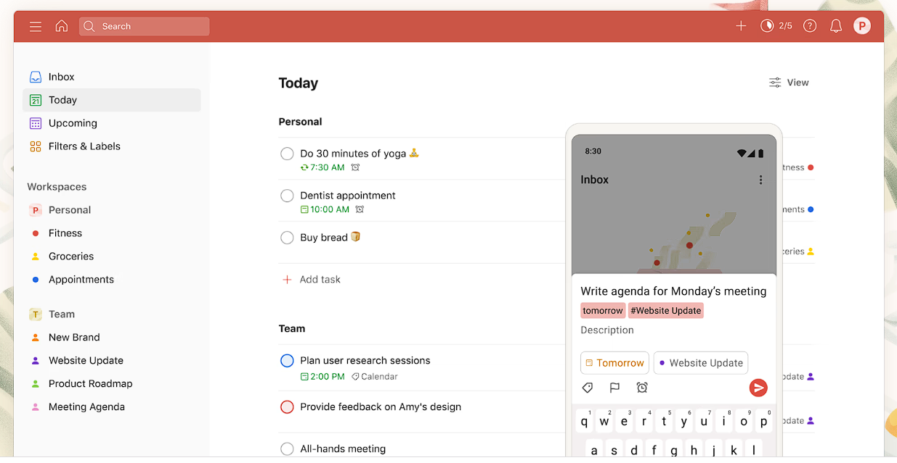
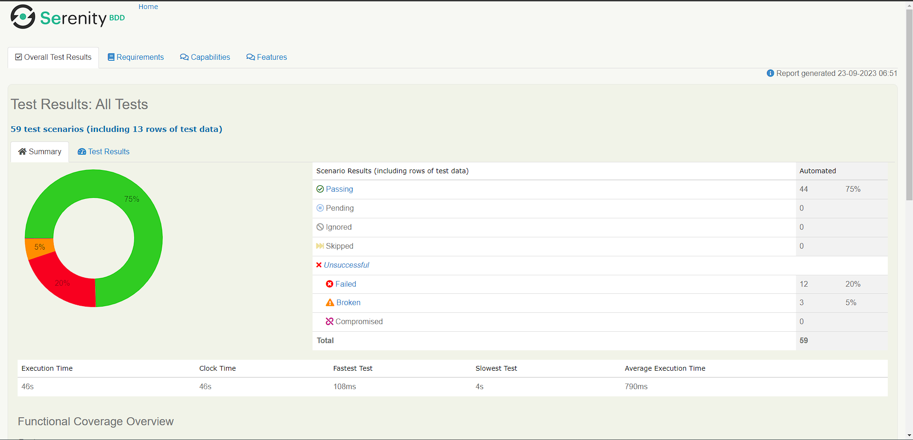
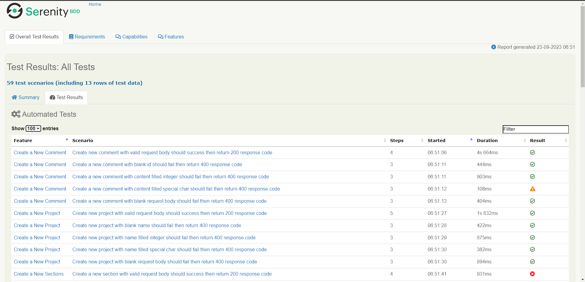

<div align="center">
<br/>
<summary><h1 style="display-inline:block">TODOIST APP</h1></summary>
Group Project Team 1 <br/>
<a href="https://docs.google.com/spreadsheets/d/1fFIs1UVqWOzbGK5iIvr5-NSWUBYlp8Ow_twiCTULbMI/edit#gid=1797173335" target="blank"></a>
<a href="https://docs.google.com/presentation/d/1N0vRHRsmXU8n69_ge9bmmmaELglWJQtX9vOgCgUTMKk/edit#slide=id.g2476c887dc0_0_74" target="blank"></a>
<a href="https://developer.todoist.com/rest/v2/?shell#overview" target="blank"></a>


</div>

## About TODOIST APP
A task and project management application used to organize tasks, to-do lists, and projects. Todoist API allows developers to interact with data and functionality from Todoist programmatically.

## Report
<br/>
<br/>

## Tools
<div>
<p>Manual Testing</p>
      <a></a>
      <p>Test Case Management</p>
      <a></a>
      <p>Automation Testing</p>
      
      
      
      
      <!--  -->
      
      
      <p>Management Project</p>
      
</div>

## Team 1 :
* [Alfian Aditya](https://github.com/alfianadityads) <br> [](https://github.com/alfianadityads)
* [Faruqi Izzuddin](https://github.com/faruqiizu) <br> [](https://github.com/faruqiizu)
* [Fathiyah Ramadhani](https://github.com/fathiyahrr) <br> [](https://github.com/fathiyahrr)

## How to Run This Project:
- Clone it

```
$ git clone https://github.com/alfianadityads/ALTA-QE12-Team1-Todoist.git
```

- Go to directory

```
$ cd ALTA-QE12-Team1-Todoist
```

- Run the project

```
$ mvn clean verify
```

- Voila! 🪄
